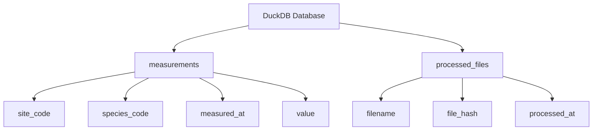

```mermaid
flowchart TD
    A["DuckDB Database"]

    A --> B["measurements"]
    A --> C["processed_files"]

    B --> D["site_code"]
    B --> E["species_code"]
    B --> F["measured_at"]
    B --> G["value"]

    C --> H["filename"]
    C --> I["file_hash"]
    C --> J["processed_at"]
```
