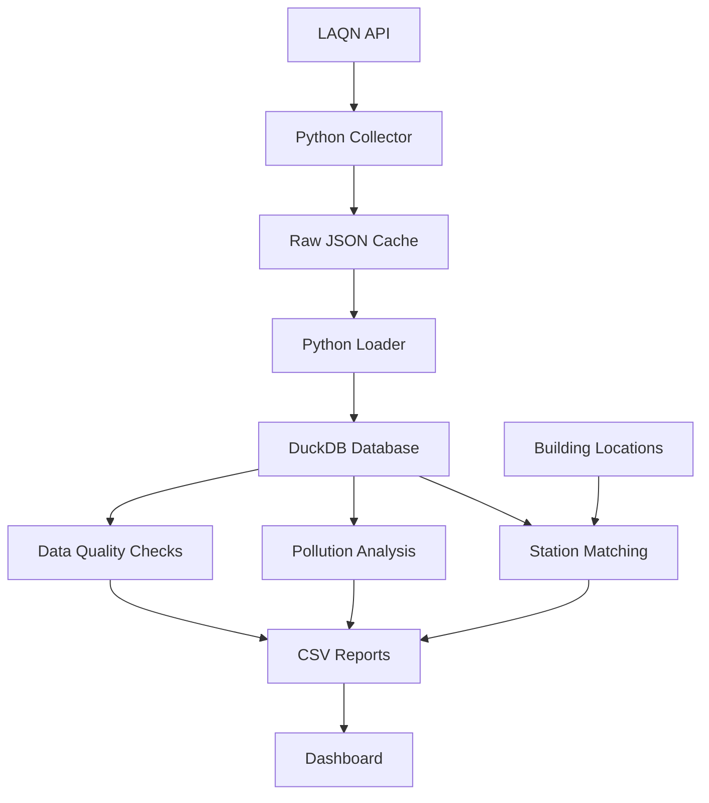

```mermaid
flowchart TD
    A["LAQN API"] --> B["Python Collector"]
    B --> C["Raw JSON Cache"]
    C --> D["Python Loader"]
    D --> E["DuckDB Database"]
    E --> F["Data Quality Checks"]
    E --> G["Pollution Analysis"]
    H["Building Locations"] --> I["Station Matching"]
    E --> I
    F --> J["CSV Reports"]
    G --> J
    I --> J
    J --> K["Dashboard"]
```
